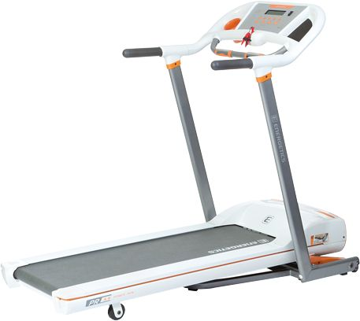

# Introduction

Thanks for buying my book! The manuscript you see before you was written to help you break out of your unhealthy routine and adopt a healthier one, hopefully without you noticing too much. But before we get into it, let's quickly explain what this book is about and who it's for. I like to call this "explaining the WWW" - the What, the Why, and the Who for.

## Why

In early 2010 I got my first enterprise programming job. I was always on the flabby side, but never obese, and your early twenties are a time during which you can do anything sadistic to your body and it'll still yell back "THANK YOU SIR, MAY I HAVE ANOTHER?" - it's a time of nigh invulnerability in one's life. That's why we feel it so much when the invulnerability wears off.

As you grow older, your metabolism slows down. You can no longer digest the same junk with the same efficiency, and you need to be more active to achieve the same results you used to take for granted. Putting all this together, my body was in for a shock in this sudden transition to sedentary cubicled office work.

In the year or so that followed, I went from 75kg to almost 100kg. (Note that I'll be using the metric system simply because [it makes sense](http://i.imgur.com/R5CYFSD.png)). That's an incredibly unhealthy gain. Then, in the summer of 2012 I was given the chance to work from home on a large project for the company, arguing I needed a distraction free environment. Quite by accident, I found a cheap used treadmill in an ad online and figured I might use it to jog, having been living in a very pedestrian-unfriendly city at the time. It was an old Energetics Power Run 5.9.

It wasn't long until I found out I'm not exactly the jogging type. Running bores me out of my mind, and when you weigh 100kg and have been sitting for the past decade, your legs tend to hurt under all that sudden unexpected weight. So I did the next best thing - I tuned it to walk mode. At first, I watched my downloaded shows and movies while walking, then I transitioned to gaming while on the move, and finally - work on the treadmill. In under three weeks, I had mastered the moving arts and could do anything while walking with the precision of a seated person. What's more, by the time the project was over three months later, I was back at around 85kg. It wasn't the starting weight, but it was a huge loss nonetheless. 

But the work-from-home period was over, and it was back to sitting. It didn't take long for me to get so fat again I had my own gravity well. Here's a picture from the office:

Yep, that's me. Long hair, black label society shirt, code. The cliche.

Eventually, I quit my job for a remote working one and have been working from home ever since. But this book isn't advice on you quitting your office job, or on eating well while in an office environment. This book is about...

## What

I wrote this book to tell you about my experiences, to teach you about the health benefits of treadmill desks over alternatives (all backed by medical facts and logic), to show you how you can make your own without ordering some of the overpriced versions you've heard of on talk shows, and to introduce you to some great exercises you can and should do while on the treadmill desk in order to remain flexible and prevent injury and strain. 

My aim is also to teach you how to maintain control over your peripherals (mouse and keyboard) without losing precision (the number one worry of all people I recommend treadmill desks to) via some handy games and exercises. I'll point out the importance of good posture and gear, I'll show you how to care for your treadmill desk and ensure longevity (I've burned through two engines, so I know what I'm talking about by now), and you'll even get some handy printable progress charts at the end of the book into which you can easily log your walking distances and durations for a bit of self-competing and statistics tracking. I've also created a Google Sheets template you can clone and use instead of the sheets at the end of the book. More on that in the Appendices.

If you follow the advice in this book, you should be able to easily master the treadmill desk within a fortnight at most. Not to toot my own horn, but if I had this book when I still worked an office job and had my treadmill at home gathering dust, I never would have gained all that weight back.

## Who

Which brings us to the "who" of it all. Whom is this book for?

If:

 - you sit for hours every day
 - you suffer from periodic lower back or neck ache, particularly while sitting
 - you're overweight but cannot or will not run and do other types of cardio exercise
 - you don't like to exercise but want to keep fit
 - you don't like gyms but want to exercise
 - you don't like dieting but want to lose weight

this book is for you.

I guarantee that if you follow the advice in this book exactly as told, you'll not only stop hurting, but you'll actually start looking and feeling better. No diets, no hunger, no removing of anything from the kitchen. If you keep eating the *exact* same things you ate so far and merely apply everything I write about in this book, you will lose weight (or at least stop gaining, if you're currently eating obscene amounts) - and that's a promise.

## The Social Stigma of Treadmill Desks

One of the biggest speedbumps on your way back to a (treadmill powered) healthy life could very well be the *awkwardness* that comes with a treadmill desk. In environments where you're subject to other people's gazes, or environments that aren't completely private, you're bound to attract the attention of those around you unless the others are in a similar situation.

Regardless of treadmill desks slowly creeping into the mainstream (you may have seen some silly articles online about [Victoria Beckham](http://www.dailymail.co.uk/tvshowbiz/article-2579728/Victoria-Beckham-tries-treadmill-built-desk-wearing-pair-towering-heels.html) using one - I mean, in high heels? Come on. You'd be in a wheelchair in two weeks), there are still some deterring factors:

- treadmill engines can be noisy. Your footsteps, too. This can be annoying to your cohabitants or coworkers if they're not properly prepared.
- depending on the speed and incline (more on that later) and your stamina, you'll probably sweat (and depending on your health levels and genetics, you might smell). Prepping a good environment to prevent that from happening or nullifying the effects of these workout symptoms via different means is of utmost importance when working alongside people in either civilian or business environments.
- you'll look weird. There's no denying it, treadmill desks look weird and without a doubt every person seeing you on one for the first time will ask you "Wow - but you can't actually work on that, can you? How can you type?", etc.

We'll work on these stigmata in the chapters that follow. We'll go through some awkward topics and try to realize that everyone is aware of them - there's no shame in sweating due to being active, for example. We'll nullify what downsides we can, justify what can't be nullified, and we'll build ourselves a walk-working environment that's pleasant to both you and everyone around you.

Note that in this book, I'm talking exclusively about electric treadmills. While magnetic ones (self-propelled, those on which you use your legs to push the ground beneath you, rather than relying on a motor dragging the ground away from you) are much cheaper, last longer, and are very practical to store (they're generally smaller than electric ones), they are not suitable for the uses I present in this book.