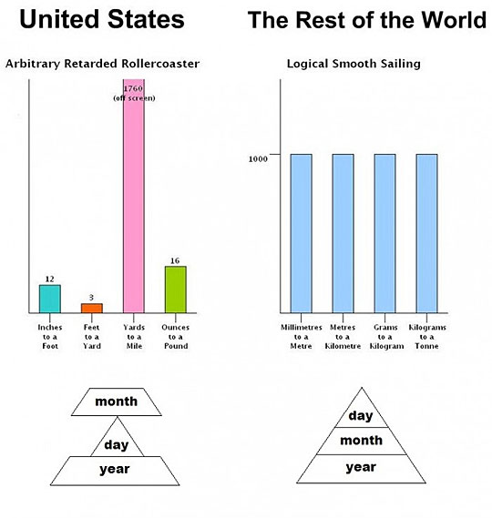

# Health Benefits of Walking

In the introductory chapter, there was a picture of an overweight viking-style me. This wouldn't be a good self-help book if it didn't have an "after" photo, too, so let me include that one as well. Here are both in quick succession. My old self:

And here's my *new* self:

Seems quite extreme, doesn't it? It really isn't, considering the time frame and simple math. Before we get to that, though, let's take a look at the physical benefits.

## Walking and Muscles

When walking, a vast array of muscles work together to keep balance, maintain posture and optimize movement - most if not all of it happening subconsciously.

The quadriceps (or *quads*) are the body's biggest muscles (no matter how much you pump any other muscle group, if you do it right, the quads are always bigger). They're at the front of the thigh, and are used to push the thigh and leg forward. Consider for a moment the relative size of your leg when compared to your body. This one muscle is responsible for moving that whole mass, several hundred times per day. The hamstrings are the "opposite" - they're at the back of the thigh and move the leg backwards and don't just serve to walk backwards - they're needed to slow the leg down on a step's finish.

Then there's the gluteal muscles (or *glutes*), or the *butt muscles*. They're in charge of finalizing and initializing a single step - either forward or backward. A step begins and ends with the glutes. When your butt is "saggy", it means the glutes aren't being used enough. The glutes work extra hard when dealing with height - the bigger the sea-level height difference between steps, the more you'll stress your glutes.

Abdominal muscles (or *abs*) contract with every step forward. They initiate the step by pulling the mass below your hips upwards and allowing a quad to move the remainder of the leg mass in the desired direction. Along with the back muscles, they also keep your upper body balanced on top of the lower half, so you don't topple over.

The calves are activated when the foot needs to bear your weight and shift balance - the calves are "fine precision" muscles that enable "non bulk" movement - they're the muscles that enable balance and direction. The tibialis anterior muscles (opposite side of the calves) are there to lift your foot when you take a step - so you don't trip over yourself, or grind the foot along the floor.

These are just a few of the muscles that get activated when one walks - there's also the rest of the abs, the lower back muscles to help with balance (else you'd fall over when taking a step in any direction that isn't 100% perpendicular to the floor), the shoulders and arms to provide inertia and make walking seamless and effortless, and much more.

Walking is, thus, a harmonious effort of dozens of muscles - each spending energy (calories) to perform its intended task, each strengthening with every step taken. We'll talk more about calories in the Exercise and Diet chapter.

But wait - there's more!

## Fat and Sugar Processing

When your body consumes sugar, it becomes much less efficient at absorbing and processing fats. In fact, some of the additional sugar turns into fat, too. The science behind this is in the excellent [That Sugar Film](http://www.imdb.com/title/tt3892434/), which I wholeheartedly recommend you watch.

But the situation isn't hopeless - all the body needs to kick the furnace into next gear is a bit of movement. If you take an hour and just watch the [BBC episode on "The truth about exercise"](http://www.bbc.co.uk/programmes/b01cywtq) (note that while the episode may be unavailable in your country, it's easily downloadable at popular torrent sites like ThePirateBay and might be available [on YouTube](https://youtu.be/_QKVKsUdeos)), you'll notice that the host's blood processed far greater amounts of fat when he walked for an hour after a fat meal, than when he opted to sit the day out (the relevant section begins at the [08:25](https://youtu.be/_QKVKsUdeos?t=511) mark and is only a few minutes long - please have a look).

If the host showed such benefits after walking for just an hour, imagine the miraculous transformations your body will go through if you spend just 4 hours every day work-walking, let alone the full 8 hour period!

## Anterior Pelvic Tilt

By far the most common symptom of too much sitting and weak back muscles, anterior pelvic tilt (APT) is the true modern plague. There's a high probability you'll see yourself in this image:

As your spine curves unnaturally due to weakened muscles (muscles that don't work because you sit all the time, and because you're in an unnatural position, leaning on elbows or rocking back and forth, left and right), the whole body suffers the consequences:

- APT makes you look fatter because it bulges your abdomen out, and curves the spine in. No matter how thin you become, you'll look bloated or fat.
- APT makes you shift your head forward, exerting your neck more, as it needs to carry more weight. This gives the impression of a "hump".
- Because your spine is curved in this forward bending fashion, it has a much harder time balancing your upper body - when it's upright, the weight pushes down and is evenly distributed. When it's in APT mode, it pushes into the hips at an angle that's uncomfortable for your body, putting more stress on your lower back and thus inflicting pain. If your lower back ever hurt unbearably after walking around town for a while or standing at a concert - that's why.

Doctors don't yet pay as much attention to APT, as it's not immediately life threatening and because it's a given that most overweight people have back and leg pain - it's attributed to their weight rather than APT. The problem with this misdiagnosis is that they're using a symptom (weight problems) as a cause of another symptom (pain). Solve APT, and both the weight and the pain go away.

The good news is that if APT is recognized on time, it can be healed almost completely with just a bit of perseverance. In the "Exercises and Diet" chapter we'll go through some stretching exercises one can use to correct APT.

It's important to note that standing **makes anterior pelvic tilt much worse**. See the "What About Standing" section for why.

## Ifs and *Butts*!

Walking has some amazing side effects on your digestion tract - from its start to finish. Even if you're a bit squeamish, you should read this section - don't worry, there won't be any photos!

If you're part of the population which spends the majority of their day sitting down, chances are extremely high you either have had or will have problems with hemorrhoids. "No way, not me - that's for old people" you might be thinking. Nope. I guarantee you'll have these problems sooner or later if you mostly sit. 

In most instances, this is nothing critical and goes away on its own, but sometimes, the symptoms may range from very painful to extreme. Hemorrhoids are actually blood vessels inside and around your rectum which, when they get enlarged, can prolapse and become painful, visible lumps, making it hard to sit, walk, or defecate. 

The science is still out on what *exactly* causes them, but it all points to extreme abdominal pressure. When your abs aren't strong enough, e.g. weakened by prolonged sitting or too weak because a sudden gain in weight is giving them more than they're used to (e.g. pregnancy), you'll strain way too much doing any kind of abdominal work (from lifting, to straining when sitting on the toilet). This strain isn't a healthy strain - it puts pressure on the veins that turn into hemorrhoids, restricting blood flow with tensed muscles, and this added pressure makes them bulge. Imagine a children's balloon being slightly worn out in one place. If you blew it full of air, that worn out part would expand first. This is what happens to your blood vessels.

Now, there are diet alterations one can apply to prevent or fix this - a high fiber diet passes through you more easily, so less strain while sitting on the toilet. Water also softens the stool up, so just increasing the daily water intake to 2L and beyond should work wonders. But there's another way - walking.

When we strain on the toilet, we don't only do so because of a very hard stool, we do it because the bowels are *really long* and we need to contract a bunch of muscles to drive the stool out through all those bends. You see, we didn't evolve to sit on toilets, we evolved to squat in the fields. While evolution may catch up eventually, and some nations (e.g. Japan) favor squatting toilets, the majority of the world still prefers sitting. When we sit, a muscle known as the *puborectalis muscle*, which is around the rectum, chokes the "pipe" and restricts the smooth flow of the stool. When we squat, this muscle is relaxed and the stool can pass through easily. 

*Image credit: https://www.studyblue.com*

When sitting, the stool cannot enter the choked rectum easily, and we strain. Straining causes hemorrhoids. If we used a squatting toilet, things would be better, but most don't have them or don't want to give them a go, having gotten used to our porcelain thrones. 

However, when walking, the content of the bowels is constantly subjected to gravitational micro-impacts. Every step is a little jolt in the right direction (downwards), so that by the time you have to go, the stool is already past the point of the *puborectalis choke*. Then, it's only a matter of sitting down, eliminating, and you're done - little to no strain necessary.

When work-walking, you'll actually notice you have "go potty" every two or three hours at least - depending on your diet - because the steps pushing the content down are constant and frequent. 

This, to some, is the most positive change introduced by work-walking. So many people have digestion problems and bowel issues, and so few attribute them to wrong posture or too much sitting - this one change in lifestyle can turn the health of one's entire nether regions around.

## What about Standing?

You've probably heard of standing desks being the hot new thing, given that you're reading this book. There's a whole lot of clickbaity posts out there selling the "miracles" of standing while working, and all of them, without fail, forget to talk about the downsides. And the ugly truth is - standing can actually hurt you more than sitting.

"Wait, what? Isn't standing better than sitting by default?" you may be wondering. Nope. Here's why.

The same upper body muscle groups that work when we walk also work to keep us upright and balanced when standing. The real difference is in the lower body, and this difference is so significant it impact the upper body, potentially causing long term harm.

When standing, glutes prevent your hips from swaying side to side, and the tensor fascia lata muscle, which is on the side of the leg from the pelvis to the knee, assists with this. Adding to that, the lower leg muscles are constantly engaged simply to keep you upright - if they relaxed, you'd be face down in the carpet. So, what's the problem with that? Working muscles are healthy muscles, no? Balance, padawan! Balance is what's important!

Aside from the fact that when we walk we engage way more muscles, it should be noted that every step is more or less equal in pressure, duration and exertion. If the steps weren't symmetrical, we'd either be falling off the treadmill or limping. This ensures that your body's weight is evenly distributed alongside your back, your abs, and your legs and feet - one at a time. 

Have you ever noticed how when you stand in long queues or are at a concert or any other standing venue you tend to lean against things? How about lifting one foot off the floor and leaning it against the wall, or even just folding it behind the other leg, toes pointing to the ground - ever did that? That's called a balance shift, and it happens when you've been standing for too long with the wrong posture. 

Your entire body was leaning on one side, likely unnoticed by you, and it gave the signal "Okay, that's enough, make the other leg bear the weight now". This imbalance creates a sort of never-ending loop where your legs will keep passing the weight to one another until you can't take it any more and have to sit down. Throughout these balance shifts, it's not even the legs and feet that suffer the most - it's the back. As your legs try to shift the blame back and forth, the back keeps the weight balanced. But the back tires because it keeps doing the exact same moves all the time. Soon, it weakens. It can no longer hold you perfectly upright and your spine bends, your entire upper body now held in place with bone only and a bit of tissue around it - the muscles are in a resting state. You get to one of these three:

*Image credit dailymail.co.uk*

Now imagine if you had a shelf to lean against at all times - like, say, a standing desk? You'd instantly go for this position, subconsciously, because your body knows it's easier that way, at least temporarily (and your body is **all** about instant gratification and no long term consequences - how else would we explain the sex drive?). This problem is further exacerbated when one has flat feet.

*Image credit www.nextsteportho.net*

Feet are configured so that the outer rim bears most of the weight. This keeps legs nice and straight. When we have flat feet, the weight falls on the medial arch, the mid part which isn't really touching the floor a whole lot with healthy feet. This is bad because it twists your ankles inwards and leads to X legs. Now imagine standing for hours with your legs bending inwards like this - can you imagine the stress this puts on your knees?

Sadly, many people treat standing desks as a holy grail, *the* way to be healthy behind a computer, and yet very few take these extreme health risks into consideration. Prolonged exposure to these negative effects might seem like "training pains" to most, but is in fact very dangerous and can lead to serious injury in the long term - the knees, back, neck, hips, shoulders and feet will all suffer. Humans never stood in one place for a long time. For thousands of years, we were nomads - constantly on the move, and even when we settled to farm, we never stood still. We either rested or worked. We simply aren't equipped for long periods of standing.

Last but not least, we have to mention the calories. This book will be using the metric system, because unlike others, it makes sense.

> *Big calories*, or *kcal*, are the unit of measurement used on food labels. One *kcal* is one *kilo calorie* or 1000 small calories. One small calorie is the amount of energy needed to heat up one gram of water up one degree Celsius (1ºC), while one kcal is the amount of energy required to increase the heat of one *kilogram* of water by 1ºC.

When standing, we spend around an additional 30 kcal per hour (note that this is 30 *plus* what our hour already costs - every living creature spends calories all the time, with 30 year old relatively healthy males spending approximately 1800 per day, for example). The extra energy expense is coming from the constant engagement of some of our muscles, used to maintain balance.

However, when walking at a slow pace (2km/h), we average about 100-200 additional kcal per hour, depending on age, weight, gender, etc. This number increases if we're walking up an incline (more on that later), and if we increase the speed. There's a handy calculator at [ShapeSense](http://www.shapesense.com/fitness-exercise/calculators/walking-calorie-burn-calculator.aspx).

This is a tremendous difference - a three to six *times* higher energy cost when walking. It's not all positive, of course - there are many hurdles when learning to walk-walk; we'll cover them all in future chapters. But even if you walk super slowly and at a zero degree incline (level ground), estimating some 100 kcal per hour, for four hours per work day instead of 8 (so really light work days), that'll come down to an additional 400 kcal per day. That might not sound like much, but put it into a weekly perspective and it's already 2000 kcal - the equivalent of having eaten nothing for an entire day, without ever actually starving yourself or dramatically changing your diet.

We'll talk about calories and energy in great detail in the Exercise and Diet chapter.

## Risks, Injuries and Discomfort

It should be noted that while I consulted medical professionals while writing this book, I'm not a medical professional. The advice within this book is based on personal experience, and the feedback of those who tried these methods and reported back. It's important to realize that walking isn't the magic bullet, the solution to all of life's problems, but when done right, it can solve many of them.

Keep in mind that if you're overweight by a lot, you should take it easy and not overdo it as you start out. Your legs are not used to the added stress and your back muscles will suffer, too. Start with one hour per day at most, and keep at it for a week or two. Only then should you start adding 20-30 minutes weekly - give your body the time to adapt.

When starting out, you'll often experience thigh burn - that's when your thighs rub against one another while walking. This is normal, it's just friction and basic physics, but coupled with salt from sweat, it can be pretty unpleasant. To avoid this, rub the area with stick deodorant - during my obese periods when this was still a big problem, I've found that creamy ones, like Dove, work best. That should last your for the entire session.

If at any point you start experiencing severe (mild is okay - severe is not) joint, neck or back pain, stop and rest, and skip the following day. Your body is probably in shock and needs time to recuperate.

We'll talk more about proper posture, good equipment and wearables, and the right way to deal with pain in later chapters.

## Summary

- walking activates many, many more muscles than sitting or standing, and spends up to six times more calories, and helps absorb far
- a wrong posture can only be worsened by standing
- sitting causes anterior pelvic tilt, but stretching exercises exist that make it go away
- walking improves the digestive tract's function and solves a plethora of awkward problems like hemorrhoids and constipation
- flat feet and standing for long periods of time are a combination deadly to your spine and posture
